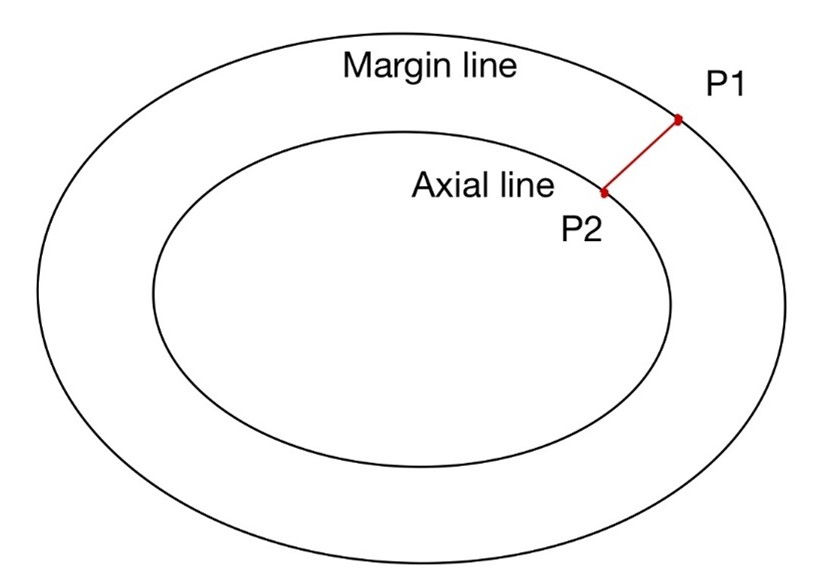
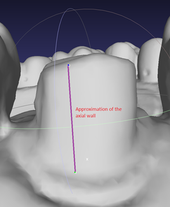
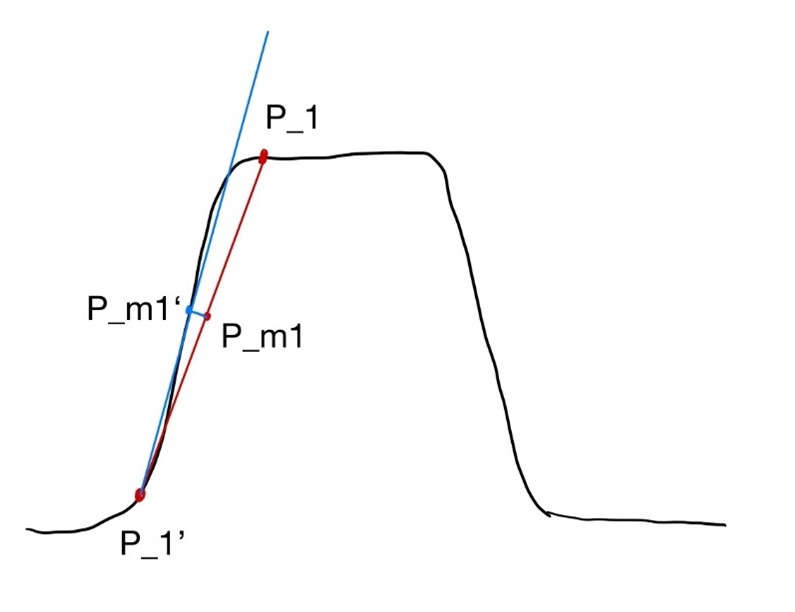
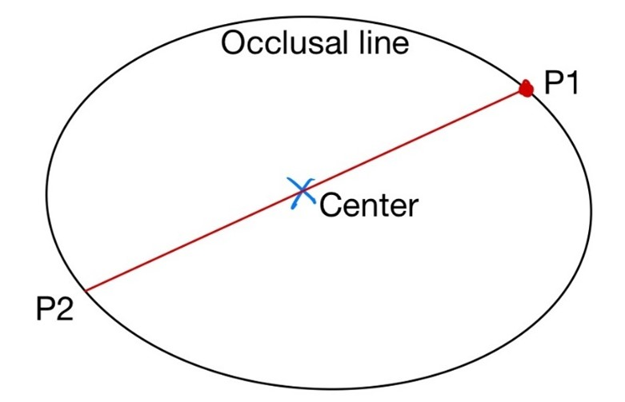
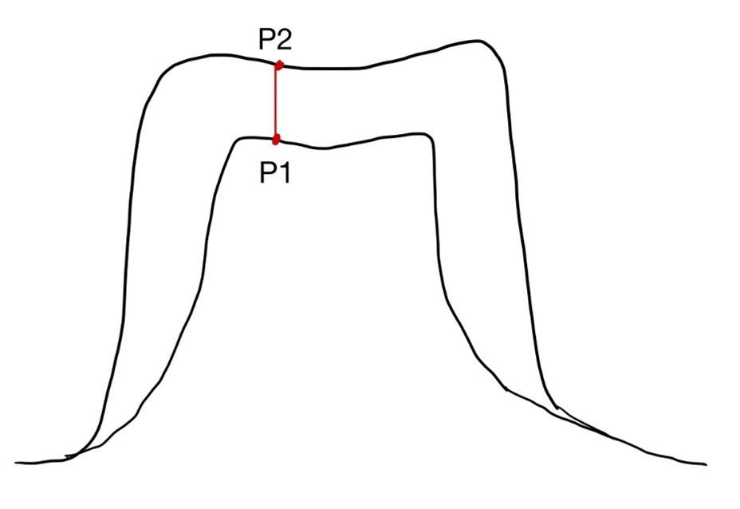
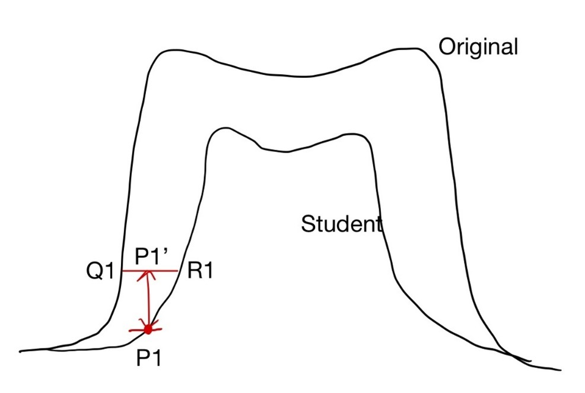
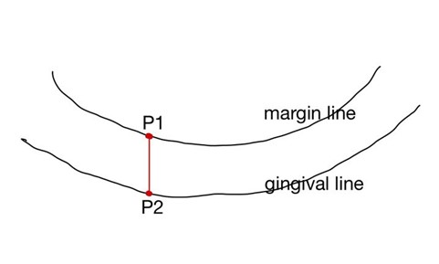

## Details about algorithms to compute each metric
### Shoulder Width
- Per-vertex value on the axial line
- For each point $P_2$ on the axial line, find the closest point $P_1$ on the margin line. Compute the distance between these two points, and the distance is an estimate of the shoulder width. By averaging the result over all points in one section, we get the shoulder width for that section.

### Axial Wall Height
- Per-vertex value on the occlusal line
- For each point $P_1$ on the occlusal line, find a point $P_1^{\prime}$ on the axial line which forms a line $P_1P_1^{\prime}$ that has the smallest angle to the vertical y-axis. The line $P_1P_1^{\prime}$ formed by these two points approximates the axial wall. The distance $|P_1P_1^{\prime}|$ is the axial wall height. Again, we average this value over all points in one section.

### Taper
- Per-vertex value on the occlusal line
- For each point $P_1$ in the occlusal line, firstly we use similar methods as we used for Axial Wall Height to find axial wall approximation $P_1 P_1^{\prime}$. After getting $P_1P_1^{\prime}$, we are doing an extra step to approximate the axial wall: find the midpoint of $P_1P_1^{\prime}$, denoted as $P_{m1}$. We then find the closest point $P_{m1}\prime$ on the model, then we use the line $P_1^{\prime} P_{m1}^{\prime}$ as the axial wall approximation. It can be explained by the following picture:

 
    We see that blue line is a better approximation of the axial wall than the red line.
- Then we find the opposing axial wall to it, i.e., the axial wall on the far side of the tooth. To achieve this, we first find the average of (x,z) coordinate of the occlusal line, and this average is an approximation of the center of the tooth (denoted as $P_{center}$). Then we iterate over points on the occlusal line and find the point $P_2$ that forms the largest angle $P_1P_{center}P_2$.

 
- Then using the same method to find axial wall approximation at $P_2$, which should be $P_2^{\prime} P_{m2}^{\prime}$, and the angled formed by the axial wall at $P_1$ and $P_2$ is the Total Occlusal Convergence, and we divide TOC by 2 to get Taper.
- By averaging result over all points on the occlusal line in one section, we get taper for that section.

### Occlusal Reduction
- Per-vertex value on the occlusal
- For each point $P_1$ on the occlusal of the student model, compute its shortest distance to the original model. By averaging the result for all vertices in one section, we get the occlusal reduction for that section.

### Margin Depth
- Per-vertex value on the margin line
- For each point $P_1$ on the margin line, add $\frac{1}{2}$ mm to its height to get a new point $P_1^{\prime}$.
Find the closest point Q on the original model to the point $P_1^{\prime}$.
Find the closest point R on the original model to the point $P_1^{\prime}$.
The distance $|QR|$ is the margin depth at this vertex.
We average this value over all points in one section.

 
### Gingival Extension
- Per-vertex value on the margin line
- For each point $P_1$ on the margin line, find $P_2$ on the gingival line that forms a line $P_1P_2$ that has the smallest angle to the vertical y-axis (either positive/negative y-axis). The difference (height of $P_1$ - height of $P_2$) is the gingival extension at that point.

